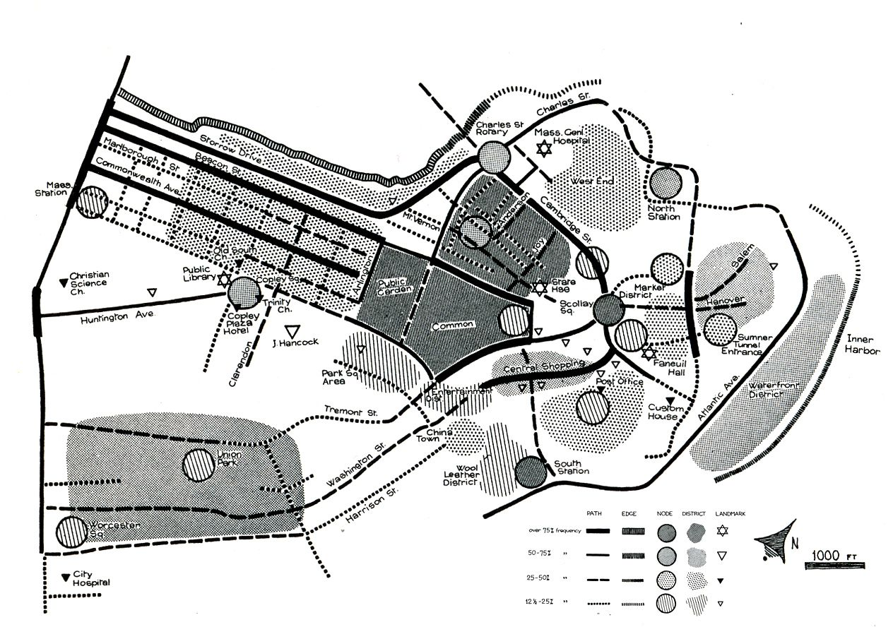

# The Computational Image of the City 

**The repository contains a series of notebooks for extracting the Computational Image of the City from geospatial datasets**

## Introduction

This repository guides the user through the extraction of the Computational Image of the City; In other words, it allows to automatically identify a set of salient urban features in line with the definitions laid down by Kevin Lynch in [The Image of The City](https://mitpress.mit.edu/books/image-city) using open and freely available geospatial datasets.

The analysis workflow is written in Python and relies on the library [cityImage](https://github.com/g-filomena/cityImage), and its dependencies (mainly: [Geopandas](http://geopandas.org), [NetworkX](https://networkx.github.io) and [OSMNx](https://osmnx.readthedocs.io/en/stable/))

The methods are fully documented in *A Computational approach to ‘The Image of the City’* by Filomena, Verstegen, and Manley, published in [Cities](https://doi.org/10.1016/j.cities.2019.01.006).

## Notebooks' purposes

* **[1a_Nodes_Paths_Districts_Web.ipynb](1a_Nodes_Paths_Districts_Web.ipynb)** It supports the identification of * Nodes, Paths* and *Districts* from street network's graphs automatically extracted from *OSM*. The user does not need to provide any kind of data.
* **[1b_Nodes_Paths_Districts_Local_Files.ipynb](1b_Nodes_Paths_Districts_Local_Files.ipynb)** It supports the identification of *Nodes, Paths* and *Districts* from the street network's graph obtained from a *.shp* file.  The user is encouraged to use this notebook if they wish to work with a street network *.shp* file in their possession.
* **[2a_Landmarks_Web.ipynb](1a_Nodes_Paths_Districts_Web.ipynb)** It identifies *Landmarks* from a set of buildings automatically extracted from *OSM*. As the *height* field may not be complete in *OSM*; some landmarkness components are not computed here.
* **[2b_Landmarks_Local_Files.ipynb](1a_Nodes_Paths_Districts_Web.ipynb)** It identifies *Landmarks* from a set of buildings in a *.shp* file provided by the user. This is the recommended and complete way to extract landmarks (if the buildings' height field is complete). 
* **[3_Barriers.ipynb](3_Barriers.ipynb)** It supports the identification of *Barriers* (*Edges* in *The Image of the City*) from several features in *OSM* (roads, railways, waterbodies and waterbanks, parks).
* **[4_Street-Network_Simplification.ipynb](4_Street-Network_Simplification.ipynb)** - This notebook presents a complex pipeline to automatically simplify a street network (either obtained from *OSM* or local files), as concerns: roundabouts, complex junctions, dual lines.

